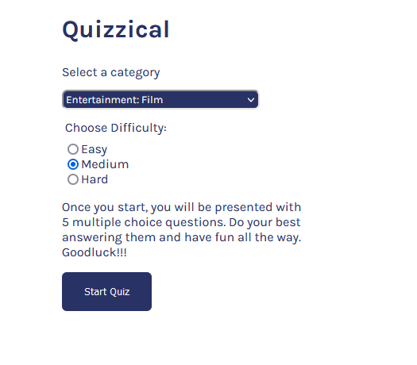
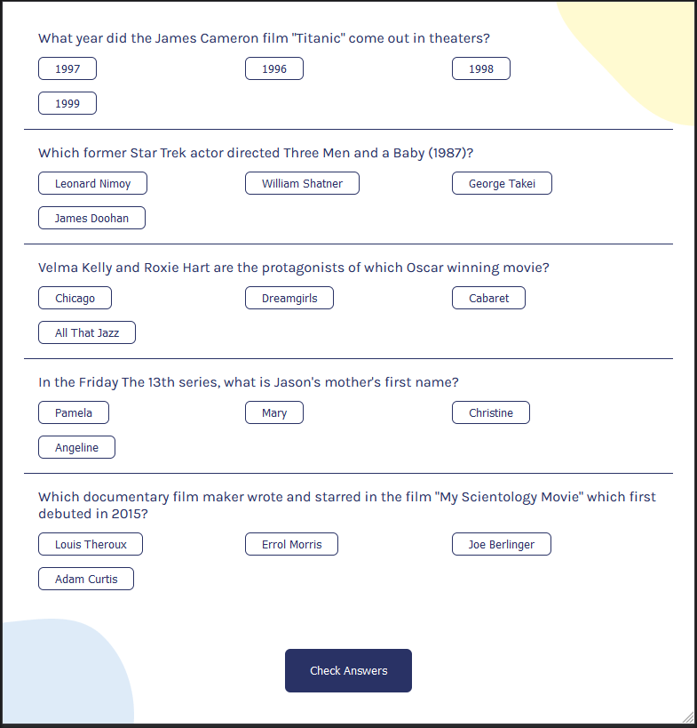
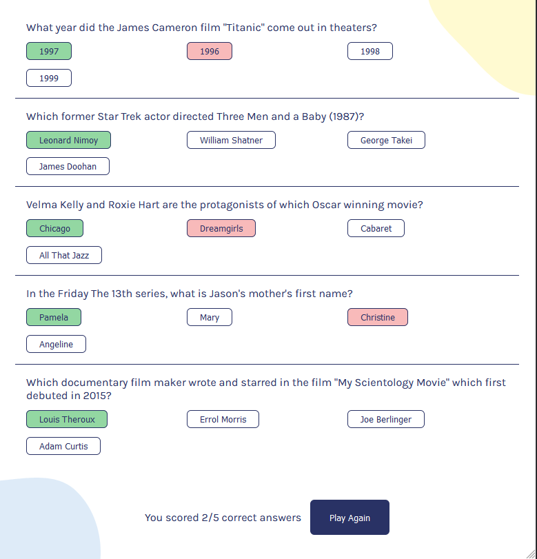

# Quizzical

## Table of contents

-   [Overview](#overview)
-   [Overall Design Process](#overall-design-process)
-   [Usage](#usage)
-   [Files to Note](#files-to-note)
-   [Contributions](#contributions)

## Overview

Quizzical, a trivia app crafted with React, empowers users to embark on exciting quizzes tailored to their interests and preferences. With options to select topics and categories defining question difficulty, users can dive into engaging gameplay sessions. Upon completion, the app promptly scores and displays results, offering users insights into their performance and the correct answers. Seamlessly designed and powered by openTriviaDB, Quizzical ensures a smooth and enjoyable trivia experience for all users.

## Overall Design Process

Built with React and utilizing Vite as a build tool, Quizzical emphasizes modularity and simplicity in its design. Data from openTriviaDB is seamlessly integrated, with a utility function employed to handle Unicode characters. Each component is meticulously organized to enhance code readability and maintainability. Noteworthy modifications include grouping answers and dynamically updating UI elements based on user interactions.

## Usage

Experience Quizzical's immersive trivia experience by navigating to the [Live URL](https://relaxed-starburst-7ce14d.netlify.app/). Users can easily select categories, start quizzes, and view results, all through an intuitive interface designed for seamless navigation and engagement. Here's an example of the application's initial screen:

And here's the screen during and after gameplay:

## Files to Note

-   src: Houses the source code for the application.
-   src/App.jsx: The application's entry point.
-   src/Quiz.jsx: Manages quiz rendering and functionality.
-   src/index.scss: Contains application styling.
-   src/RadioComp.jsx: Handles category selection via radio buttons.
-   src/QuizOptionsForm.jsx: Collects user options and initiates API calls to fetch initial data.

## Contributions

Contribute to Quizzical's growth and improvement by forking the repository and submitting pull requests. Your ideas and insights are valued contributions to enhancing the app's functionality and user experience. Let's collaborate to make Quizzical even better!
